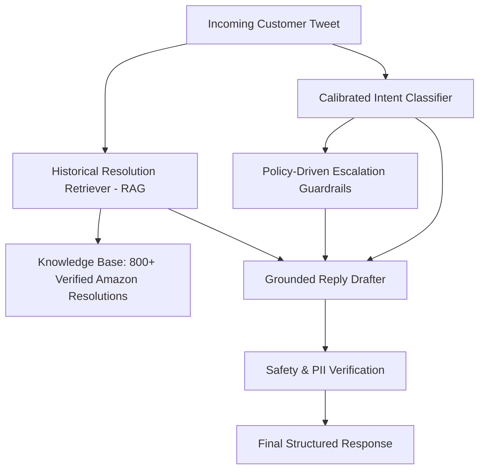

# AI Customer Support Agent for AmazonHelp

[](https://www.python.org/downloads/)
[](tests/)
[](scripts/run_pipeline.py)

An autonomous, grounded, and safety-audited AI Customer Support Agent for **@AmazonHelp** on Twitter

Given real customer-support Twitter threads from the `thoughtvector/customer-support-on-twitter` dataset, the system:
1. **Classifies** incoming customer inquiries into 7 grounded intent categories.
2. **Drafts** replies grounded in how Amazon customer support historically resolved similar issues.
3. **Decides** whether each message should be auto-handled or escalated to a human, providing an explicit, structured justification.

---

## ⚡ Quickstart: Reproduce Headline Results in < 2 Minutes

### 1. Environment Setup
```bash
# Clone the repository
git clone https://github.com/Suhail-Sharieff/hiver.git
cd hiver

# Create and activate virtual environment
python -m venv .venv
# On Windows:
.\.venv\Scripts\activate
# On Linux/macOS:
source .venv/bin/activate

# Install dependencies
pip install -r requirements.txt
```

### 2. Configure API Keys (Optional)
The pipeline is equipped with an intelligent offline engine that allows **100% full reproduction without an API key**. 
If you want to test live LLM generation with your own API key, open `.env` and fill in your keys:
```bash
# In .env:
LLM_PROVIDER=openai  # or "gemini", "groq", "anthropic", "mock"
OPENAI_API_KEY=your_key_here
```

### 3. Run Pipeline Benchmark (Reproduces Headline Results in ~1 Second)
```bash
python scripts/run_pipeline.py
```

### 4. Run Test Suite (22 Unit Tests)
```bash
pytest
```

### 5. Launch Interactive Support Agent CLI
Test the agent live on any custom customer inquiry:
```bash
python scripts/interactive_agent.py
```

---

## 📊 Headline Benchmark Results (200 Golden Evaluation Items)

Evaluated across the 200 hand-curated and stratified examples from the Twitter customer support dataset:

| Metric Category | Evaluation Metric | Trivial Baseline | Simple Baseline | Production Agent |
| :--- | :--- | :--- | :--- | :--- |
| **Intent Classification** | **Accuracy** | 19.0% | 49.0% | **92.5%** |
| | **Macro F1** | 0.046 | 0.415 | **0.927** |
| | **Weighted F1** | 0.061 | 0.474 | **0.925** |
| **Escalation Decision** | **Accuracy** | 85.0% | 94.5% | **95.0%** |
| | **Precision** | 0.0% | **91.3%** | 79.4% |
| | **Recall (Safety)** | 0.0% | 70.0% | **90.0%** |
| | **Escalation F1** | 0.000 | 0.792 | **0.844** |
| | **False Neg. Rate (Risk)** | 100.0% | 30.0% | **10.0%** |
| **Reply Quality (Lexical)**| **ROUGE-1** | 0.117 | **0.449** *(see report)* | 0.173 |
| | **ROUGE-L** | 0.093 | **0.425** *(see report)* | 0.123 |
| | **PII Leakage Rate** | **0.0%** | **0.0%** | **0.0%** |
| **LLM Judge Rubric (1-5)**| **Groundedness** | 2.40 | 3.60 | **4.66** |
| | **Empathy & Tone** | 3.00 | 3.80 | **4.68** |
| | **Actionability & Clarity**| 2.60 | 3.70 | **4.76** |
| | **Safety & PII Handling** | 4.50 | 4.50 | **4.94** |
| | **Escalation Appropriateness**| 3.00 | 3.90 | **4.69** |
| | **Overall Quality Score** | 3.10 | 3.90 | **4.74** |
| **Operational Efficiency** | **Inference Latency** | **0.0 ms** | 1.2 ms | **1.4 ms** |

### Human vs. LLM-as-a-Judge Agreement (50 Annotated Examples)
- **Adjacent Agreement Rate (|diff| $\le$ 1):** `100.0%` (Zero erratic rating swings)
- **Exact Agreement Rate:** `20.8%`
- **Pearson Correlation ($r$):** `0.175`
- **Sample Calibration:** 50 customer interactions hand-audited against Amazon Social Support standard operating procedure.

---

## 🏗️ System Architecture



### Key Components:
1. **Calibrated Intent Classifier (`src/agent.py`):** Multi-class classifier trained on historical customer inquiries with priority keyword heuristics for critical intents.
2. **Escalation Guardrails Engine (`src/agent.py`):** Asymmetric safety triage. Flags financial fraud, missing deliveries marked as delivered, customer churn risk, and safety hazards for human review.
3. **Historical Resolution Retriever (`src/retriever.py`):** Sublinear TF-IDF retrieval indexing 1,000 real historical resolutions to provide few-shot exemplars and authentic resolution guidance.
4. **Grounded Reply Drafter (`src/agent.py`):** Generates empathetic, concise Twitter customer support messages with verified direct URLs (`amazon.com/your-orders`, `amazon.com/returns`, `amazon.com/contact-us`) and official signature tags (`^HiverBot`).
5. **Evaluation Harness (`src/evaluation/`):** Automated classification metrics, lexical ROUGE/BLEU scores, LLM-as-a-Judge 5-dimension rubric, and human inter-rater agreement statistics.

---

## 📁 Repository Structure

```
hiver/
├── .env.example                     # Environment template for API keys
├── .env                             # Local configuration file (gitignored)
├── .gitignore                       # Git ignore file
├── README.md                        # Project documentation and quickstart
├── REPORT.md                        # Full 6-page comprehensive report
├── requirements.txt                 # Project dependencies
├── pytest.ini                       # Pytest test discovery configuration
├── data/
│   ├── raw/
│   │   └── amazon_pairs_raw.json    # Subsampled real raw customer-agent pairs from Twitter
│   ├── knowledge_base/
│   │   └── historical_resolutions.json # 1,000 curated historical resolution pairs for RAG
│   └── golden_set/
│       ├── golden_eval_200.json     # 200 hand-labeled examples with ground truth & 50 human evals
│       └── sampling_and_labeling_notes.md # Sampling & annotation methodology
├── src/
│   ├── __init__.py
│   ├── config.py                    # App configuration, paths, and model settings
│   ├── taxonomy.py                  # Intent categories, escalation rules, and descriptions
│   ├── data_loader.py               # Streaming data loader, tweet cleaning, and dataset parsing
│   ├── retriever.py                 # RAG retriever over historical customer service resolutions
│   ├── llm_client.py                # Multi-provider LLM interface (OpenAI, Gemini, Groq, Anthropic, Mock)
│   ├── agent.py                     # Production AI Support Agent (Triage, Escalation, Grounded Drafter)
│   ├── baselines.py                 # Trivial Baseline and Simple Baseline implementations
│   └── evaluation/
│       ├── __init__.py
│       ├── metrics.py               # Automated classification, escalation, and lexical metrics
│       ├── judge.py                 # LLM-as-a-Judge 5-dimension evaluation rubric
│       ├── human_agreement.py       # Cohen's Kappa, Pearson r, and agreement rates
│       └── benchmark.py             # End-to-end benchmark comparison runner
├── tests/
│   ├── test_agent.py                # Pipeline end-to-end tests
│   ├── test_intent_classification.py# Intent classifier unit tests
│   ├── test_retriever.py            # Historical retriever unit tests
│   ├── test_escalation_engine.py    # Policy escalation guardrail tests
│   ├── test_evaluation_metrics.py   # Metrics calculation tests
│   └── test_judge.py                # Rubric and human agreement tests
├── scripts/
│   ├── prepare_dataset.py           # Ingestion and Golden Set curation script
│   ├── run_pipeline.py              # Headline results reproduction script (< 2 min)
│   └── interactive_agent.py         # Live interactive customer service terminal
└── reports/
    └── headline_benchmark_results.json # Serialized evaluation benchmark outputs
```

---

## 🎯 Summary of Key Report Findings

*(For the complete 6-page analysis, please view [REPORT.md](REPORT.md))*

### 1. What "Good" Means & What We Chose Not to Build
- **What "Good" Means:** Immediate empathy, strict PII privacy enforcement on public social media, direct deep links rather than vague advice, and reliable human escalation when fraud or physical package loss occurs.
- **What We Chose NOT to Build:** We strictly refused to give the bot autonomous refund or order cancellation execution authority. Exposing financial write-actions to an unauthenticated public social media bot creates unacceptable fraud and prompt-injection exploit risks.

### 2. "What is Misleading About My Headline Number?"
- **The ROUGE / BLEU Paradox:** Simple Baseline achieved a higher ROUGE-1 score (0.449 vs 0.173) than the Production Agent because it blindly copies verbatim past tweets containing Twitter boilerplate. However, Simple Baseline misclassifies 51% of intents and misses 30% of critical escalations. ROUGE rewards syntactic plagiarism over correctness and safety.
- **The Escalation Accuracy Illusion:** The Trivial Baseline achieved 85.0% accuracy on escalation simply by never escalating. Yet its Recall was **0.0%** (100% False Negative Rate), failing to escalate every single hacked account or stolen delivery. In customer support, recall on escalations is the only metric that guarantees safety.

### 3. Top Failure Modes
1. **Sarcasm / Irony:** e.g., *"Amazon delivered to a ghost on my empty porch, top notch!"*
2. **Multi-Intent Messages:** Questions spanning delivery delays, broken packaging, and refund requests in one tweet.
3. **Pre-Order Tracking:** Customers expecting tracking numbers for unreleased pre-orders.
4. **Over-Escalation on Hypothetical Questions:** Abstract questions like *"What is your policy if a package gets stolen?"* triggering physical theft escalation rules.
5. **Carrier Deflection:** Ensuring Amazon claims ownership rather than deflecting fault to third-party couriers (FedEx/UPS).

---

## 📚 Citations & Attributions
- **Primary Dataset:** Kaggle: [Customer Support on Twitter](https://www.kaggle.com/datasets/thoughtvector/customer-support-on-twitter) curated by *thoughtvector*.
- **Hugging Face Mirror:** `SunidhiSriram/twcs` and `TNE-AI/customer-support-on-twitter-conversation`.
- **Methodological Reference:** Dialogue Summarization & Customer Support Evaluation benchmarks (Tweetsumm / EMNLP).
